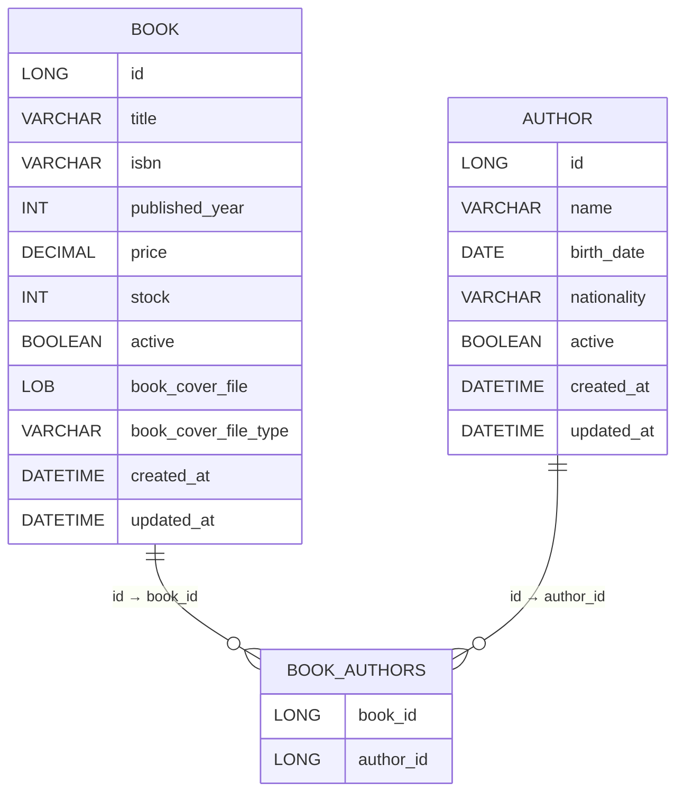

# Bookstore API

This repository contains a simple Bookstore REST API built with Spring Boot. It provides endpoints to manage authors and books, supporting creation, updates, activation/deactivation and basic relations between books and authors.

The README follows the same style used in the author's other project and includes quick start instructions, API documentation, examples and development notes.

## Table of Contents

- [Technologies](#technologies)
- [Data Model](#data-model)
- [Getting Started](#getting-started)
  - [Prerequisites](#prerequisites)
  - [Run with Maven](#run-with-maven)
  - [Run with Docker (Postgres)](#run-with-docker-postgres)
- [API Documentation](#api-documentation)
  - [Authors endpoints](#authors-endpoints)
  - [Books endpoints](#books-endpoints)

## Technologies

- Java 17+
- Maven
- Spring Boot
- Spring Data JPA
- PostgreSQL

## Data model

The main domain entities and their relationship (Mermaid ER diagram):



## Getting Started

### Prerequisites

- Java 17+
- Maven 3.6+
- (Optional) Docker & Docker Compose if you prefer running Postgres in a container

### Run with Maven

Run the application locally using Maven:

```bash
mvn spring-boot:run
```

By default the app runs on port 8080.

### Run with Docker (Postgres)

You can run a PostgreSQL container and configure the app to use it. Example Docker command:

```bash
docker run --name my-postgres \
  -e POSTGRES_USER=myuser \
  -e POSTGRES_PASSWORD=secretpassword \
  -e POSTGRES_DB=mydb_name \
  -p 5555:5432 \
  -d postgres:16
```

Then update `.env` file with the datasource connection and start the app.

## API Documentation

Base paths:

- Authors: `/authors`
- Books: `/books`

### Authors endpoints

- GET /authors
  - Query params: `active` (optional, true/false)
  - Returns list of authors

- GET /authors/{id}
  - Returns an author by id

- GET /authors/{id}/books
  - Returns books linked to an author

- POST /authors
  - Create an author
  - Body (JSON):

```json
{
  "name": "Jane Doe",
  "birth_date": "1980-05-01",
  "nationality": "Brazilian"
}
```

- PATCH /authors/{id}
  - Update an author (partial)
  - Body accepts the same fields as POST, all optional

- PATCH /authors/{id}/activate
  - Activate a previously deactivated author

- DELETE /authors/{id}
  - Deactivate an author
  - Query param: `force` (optional). If the author has active linked books and `force` is not true, the request will fail with details of the linked books. If `force=true`, linked active books will be deactivated automatically before author deactivation.

### Books endpoints

- GET /books
  - Query params: `active` (optional, true/false)
  - Returns list of books

- GET /books/{id}
  - Returns a book by id

- GET /books/{id}/authors
  - Returns authors linked to a book

- GET /books/{id}/cover
  - Return the book cover as a binary file.

- POST /books
  - Create a book
  - Body (JSON):

```json
{
  "title": "Clean Architecture",
  "isbn": "978-0134494166",
  "publish_year": 2017,
  "price": 49.90,
  "stock": 10,
  "author_ids": [1, 2]
}
```

- PATCH /books/{id}
  - Update a book (partial). Fields are the same as POST but optional. `author_ids` can be used to replace the book's author links.

- PATCH /books/{id}/activate
  - Activate a previously deactivated book (will verify linked authors are active)

- PATCH /book/{id}/cover
  - Update the book cover with the data sent in the request.

- DELETE /books/{id}
  - Deactivate a book (soft delete). Returns 204 No Content on success.

- DELETE /books/{id}/cover
  - Delete the book cover file.
